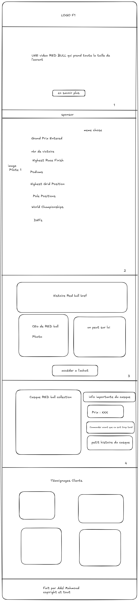

# TP-creation-d-une-landing-page
# F1 Shop

Ce projet est une landing page réalisée par **Mahmoud Adel** dans le cadre de mes études à **Ynov Aix**, en première année du parcours **Data & Intelligence Artificielle**.  
Le site a été conçu pour présenter l’univers de la Formule 1 à travers l’écurie **Red Bull Racing**, et mettre en avant un produit : un casque de pilote de légende.

## Le plan pour le landing page

## Description du site
La page est composée de plusieurs sections :
- Une **vidéo d’introduction** pour présenter l’écurie Red Bull Racing.  
- Une **présentation des deux pilotes** actuels.  
- Une **brève histoire de l’écurie** et de ses performances.  
- Une **présentation du CEO** de Red Bull Racing.  
- Une **section produit** dédiée à la vente d’un casque de Formule 1.
- Enfin,des **retout** de la part des clients.

## Technologies utilisées
- **HTML5** pour la structure du site  
- **CSS3** pour le design et la mise en page  
- **JavaScript** pour quelques effets dynamiques

## Informations
Toutes les images, vidéos et éléments visuels utilisés sont destinés à un **usage purement pédagogique** et **non commercial**.

